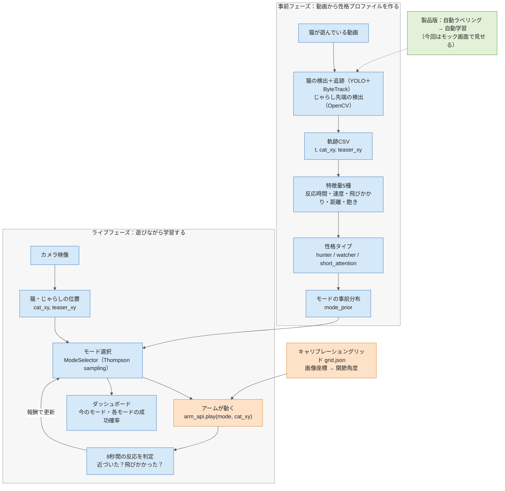

# La Machine Hackathon — 猫の性格に合わせて遊ぶロボットアーム

## コンセプト

猫が遊んでいる短い動画から「遊び方の性格」を判定し、ロボットアーム（Hugging Face SO-101）に取り付けた猫じゃらしの動かし方を、その猫に合わせて選ぶ。遊んでいる最中の反応を見て、動きの選択をその場で学習・更新していく。

製品としての将来像：飼い主が動画をアップロードするだけで、検出モデルの学習と性格プロファイルの作成が自動で行われるパイプライン。

## 全体の流れ

システムは2つのフェーズに分かれる。**事前フェーズ**で猫の動画から性格プロファイルを作り、**ライブフェーズ**でそのプロファイルを出発点に、猫の反応を見ながらアームの動かし方を学習していく。



色分け：オレンジ＝アーム担当、青＝Takako、緑＝プロダクト担当

### 担当間の受け渡しポイント

誰かが誰かを待つ場所。ここが遅れると後ろが全部詰まるので、時刻を守るか、守れないと分かった時点で全員に声をかける。

| 期限 | 渡す人 → 受け取る人 | 渡すもの | 受け取った人がすること |
|---|---|---|---|
| 金 22:00 | Takako → 全員 | 猫動画（共有フォルダ） | プロダクト担当はピッチ用のカット選び |
| 金 22:00 | アーム → Takako | Python から関節角度で動くことの確認 | 統合ループの設計を確定 |
| 土 10:00 | アーム ⇄ Takako（同時作業） | `grid.json`（カメラ固定後に2人で作る） | アーム：`move_to_pixel` 実装 / Takako：じゃらし座標の検証 |
| 土 12:00 | アーム → Takako | `move_to_pixel` と `play` の仮実装（動きは雑でよい、関数名と引数は確定） | 統合ループに組み込む |
| 土 12:00 | プロダクト ⇄ Takako | ターゲット市場の合意、性格タイプの名前 | プロダクト：モック画面の文言 / Takako：ピッチの骨組み |
| 土 16:30 | Takako → プロダクト | 性格のレーダーチャート画像 | モック画面の見た目を揃える |
| 土 16:30 | 全員 | 統合開始 | 端から端まで一度通す |
| 土 20:00 | プロダクト → 全員 | 統合が通った瞬間の動画 | デモ失敗時の保険・スライドに埋め込み |
| 日 11:00 | 全員 | コードフリーズ | 以降はバグ修正のみ |
| 日 11:00 | プロダクト → Takako | スライドと想定問答リスト | 12:00 からのリハーサルで使う |

### 待ちを作らないコツ

- Takako は本物の `arm_api` が届くまで、**関数名だけ同じで中身は print するだけのスタブ**を使って統合ループを書き進める
- アーム担当は、ビジョンを待たずに**手で決めた座標のリスト**を `move_to_pixel` に流してテストする
- プロダクト担当は、デモ映像が撮れるまで**猫動画とモック画面**だけでスライドを組み始める

## チームと担当

| 担当 | 人 | 詳細手順 |
|---|---|---|
| アーム制御 | （名前） | `01_arm.md` |
| ビジョン・統合・学習ロジック・ピッチ | Takako | `02_vision_integration_pitch.md` |
| プロダクト・市場リサーチ | （名前） | `03_product_market.md` |

## 全体スケジュール

- **金 18:00–22:00** キックオフ、セットアップ。ゴール：アームが指定ポーズに動く／動画から猫の軌跡が取れる
- **土 08:30–20:00** 本開発。12:00 中間チェック①、16:30 から全員で統合。ゴール：端から端まで一度通しで動く
- **日 08:00–14:00** 仕上げ。11:00 で新機能打ち止め、12:00 からリハーサル2回＋成功時の録画
- **日 15:00–20:00** デモ・審査

## 担当間の約束事（インターフェース）

ここを最初に決めておけば、3人が並行して作業できる。全部を1台のノートPC上の1つのPythonプロセスで動かす前提（アームはUSBでこのPCに接続）。ネットワーク越しの通信は使わない。

### アーム → 他の人に提供するもの

```python
# arm_api.py（アーム担当が実装）
def connect() -> None: ...
def go_home() -> None: ...                        # 安全な待機姿勢
def move_to_pixel(x: int, y: int, speed: float) -> None: ...
    # カメラ画像上の座標 (x, y) に、じゃらしの先端を持っていく
    # speed: 0.0（ゆっくり）〜 1.0（最速、ただし安全上限内）
def play(mode: str, target_xy: tuple[int, int], duration_s: float) -> None: ...
    # mode: "bird" | "mouse" | "peek" | "tease"
def emergency_stop() -> None: ...                 # トルクOFF
def disconnect() -> None: ...
```

### ビジョン → 統合ロジックに渡すもの（毎フレーム）

```python
{
  "t": 12.34,                  # 秒
  "cat_xy": (412, 300) | None, # 猫バウンディングボックスの中心
  "cat_box": (x1, y1, x2, y2) | None,
  "teaser_xy": (220, 180) | None,
}
```

### 性格プロファイル（動画1本 → 1つ）

```python
{
  "cat_name": "Popo",
  "type": "hunter" | "watcher" | "short_attention",
  "features": {
    "reaction_latency_s": 0.8,
    "max_speed_px_s": 950,
    "pounce_rate_per_min": 4.2,
    "mean_distance_to_teaser_px": 140,
    "engagement_half_life_s": 45
  },
  "mode_prior": {"bird": 0.5, "mouse": 0.2, "peek": 0.2, "tease": 0.1}
}
```

## 会場ルールで確認すること（金曜のうちに主催者へ）

- ノートPC内蔵カメラ／スマホをカメラとして使ってよいか（「持ち込みセンサー」扱いにならないか）
- 事前に書いた猫じゃらしコードを使ってよいか
- 猫じゃらし本体（おもちゃ）の持ち込みは可か


cat videos
https://drive.google.com/drive/folders/1ddTBBlvya5GX-K7VwuDmari4Vkc1ep1L?usp=sharing