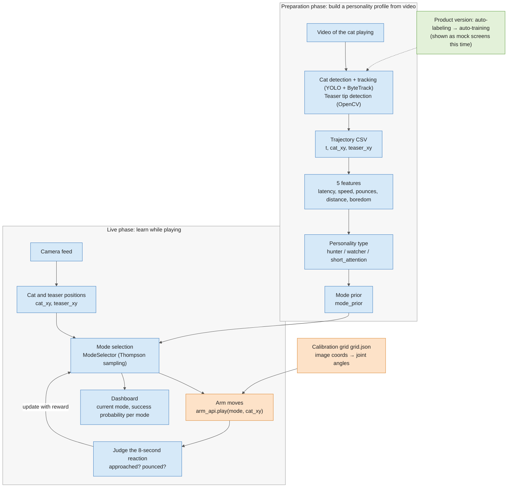

# La Machine Hackathon — A Robot Arm That Plays to Each Cat's Personality

## Concept

From a short video of a cat playing, we infer its "play personality" and choose how the teaser toy mounted on a robot arm (Hugging Face SO-101) should move for that specific cat. While the cat plays, we watch its reactions and keep learning and updating which movements to use.

The product vision: an owner simply uploads videos, and a pipeline automatically trains the detection model and builds the cat's personality profile.

## Overall Workflow

The system has two phases. In the **preparation phase** we build a personality profile from cat videos; in the **live phase** we start from that profile and learn how to move the arm by watching the cat's reactions.



Colors: orange = arm owner, blue = Takako, green = product owner

### Handoff Points Between Roles

These are the places where someone waits on someone else. If one slips, everything behind it stalls — so hit the time, or tell everyone as soon as you know you won't.

| Deadline | From → To | What | What the receiver does next |
|---|---|---|---|
| Fri 22:00 | Takako → everyone | Cat videos (shared folder) | Product owner picks clips for the pitch |
| Fri 22:00 | Arm → Takako | Confirmation the arm moves from joint angles via Python | Finalize the integration loop design |
| Sat 10:00 | Arm ⇄ Takako (together) | `grid.json` (built by both after fixing the camera) | Arm: implement `move_to_pixel` / Takako: verify teaser coordinates |
| Sat 12:00 | Arm → Takako | Draft `move_to_pixel` and `play` (rough motion OK; function names and arguments final) | Plug into the integration loop |
| Sat 12:00 | Product ⇄ Takako | Agree on target market and personality type names | Product: copy for mock screens / Takako: pitch outline |
| Sat 16:30 | Takako → Product | Personality radar chart image | Match the mock screens' look |
| Sat 16:30 | Everyone | Start integration | Run end to end once |
| Sat 20:00 | Product → everyone | Video of the moment integration works | Backup if the demo fails; embed in slides |
| Sun 11:00 | Everyone | Code freeze | Bug fixes only after this |
| Sun 11:00 | Product → Takako | Slides and expected Q&A list | Use in rehearsals from 12:00 |

### Tips to Avoid Waiting

- Until the real `arm_api` is ready, Takako writes the integration loop against a **stub with the same function names that just prints**
- The arm owner tests `move_to_pixel` with a **hand-picked list of coordinates** instead of waiting for vision
- The product owner starts building slides from the **cat videos and mock screens** before the demo video exists

## Team and Roles

| Role | Person | Detailed steps |
|---|---|---|
| Arm control | (name) | `01_arm.md` |
| Vision, integration, learning logic, pitch | Takako | `02_vision_integration_pitch.md` |
| Product & market research | (name) | `03_product_market.md` |

## Overall Schedule

- **Fri 18:00–22:00** Kickoff and setup. Goal: the arm moves to a commanded pose / we can extract a cat trajectory from video
- **Sat 08:30–20:00** Main build. 12:00 checkpoint #1; from 16:30 everyone integrates. Goal: the full pipeline runs end to end at least once
- **Sun 08:00–14:00** Polish. 11:00 feature freeze; from 12:00 two rehearsals + record a successful run
- **Sun 15:00–20:00** Demos and judging

## Interfaces Between Roles

Agree on these first and all three of us can work in parallel. Everything runs in a single Python process on one laptop (the arm connects to it over USB). No networking between machines.

### What the arm provides to everyone else

```python
# arm_api.py (implemented by the arm owner)
def connect() -> None: ...
def go_home() -> None: ...                        # safe resting pose
def move_to_pixel(x: int, y: int, speed: float) -> None: ...
    # move the teaser tip to camera-image coordinates (x, y)
    # speed: 0.0 (slow) to 1.0 (fastest, still within safety limits)
def play(mode: str, target_xy: tuple[int, int], duration_s: float) -> None: ...
    # mode: "bird" | "mouse" | "peek" | "tease"
def emergency_stop() -> None: ...                 # torque OFF
def disconnect() -> None: ...
```

### What vision passes to the integration logic (every frame)

```python
{
  "t": 12.34,                  # seconds
  "cat_xy": (412, 300) | None, # center of the cat's bounding box
  "cat_box": (x1, y1, x2, y2) | None,
  "teaser_xy": (220, 180) | None,
}
```

### Personality profile (one per video)

```python
{
  "cat_name": "Popo",
  "type": "hunter" | "watcher" | "short_attention",
  "features": {
    "reaction_latency_s": 0.8,
    "max_speed_px_s": 950,
    "pounce_rate_per_min": 4.2,
    "mean_distance_to_teaser_px": 140,
    "engagement_half_life_s": 45
  },
  "mode_prior": {"bird": 0.5, "mouse": 0.2, "peek": 0.2, "tease": 0.1}
}
```

## Venue Rules to Check With the Organizers (on Friday)

- Can we use a laptop's built-in camera or a phone as the camera (i.e. it doesn't count as "bringing your own sensors")?
- Can we use teaser code written before the event?
- Can we bring the teaser toy itself?
